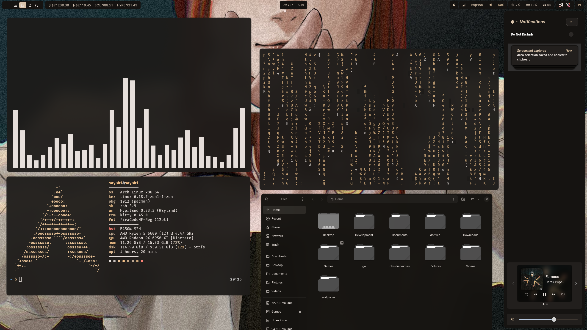
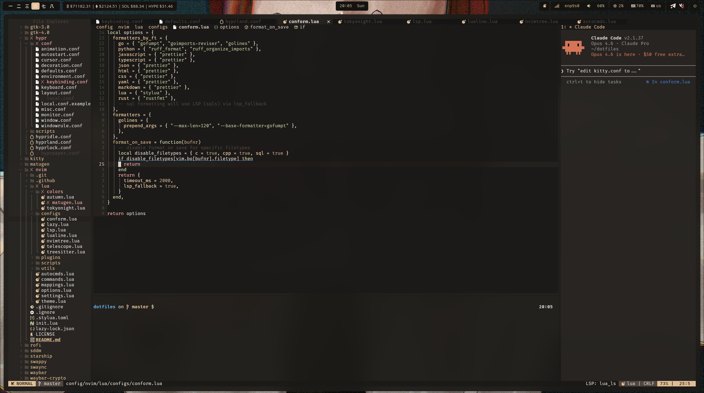
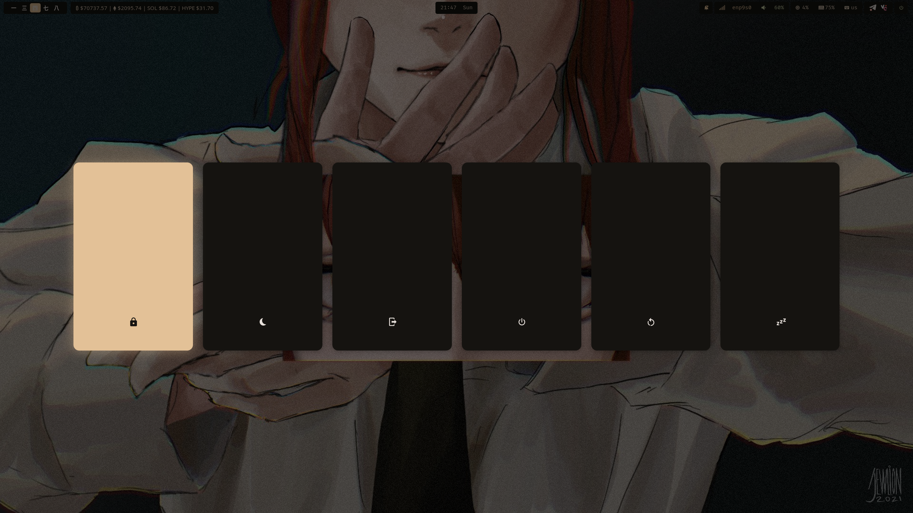

# Dotfiles

Personal configuration files for Arch Linux with Hyprland.

## Preview

|                                 |                                 |
| ------------------------------- | ------------------------------- |
|  |        |
|    |  |

## Stack

- **WM**: [Hyprland](https://hyprland.org/) - Dynamic tiling Wayland compositor
- **Terminal**: [Kitty](https://sw.kovidgoyal.net/kitty/) - GPU-accelerated terminal
- **Shell**: ZSH + Starship
- **Editor**: [Neovim](https://neovim.io/)
- **Bar**: [Waybar](https://github.com/Alexays/Waybar)
- **Launcher**: [Rofi](https://github.com/davatorium/rofi)
- **Notifications**: [SwayNC](https://github.com/ErikReider/SwayNotificationCenter)
- **Colors**: [Matugen](https://github.com/InioX/matugen) - Material You color generation from wallpaper
- **Display Manager**: SDDM with Silent theme
- **Wallpaper Engine**: [swww](https://github.com/Horus645/swww) - Animated wallpaper daemon

## Structure

```
dotfiles/
├── config/              # Application configs (symlinked to ~/.config/)
│   ├── hypr/            # Hyprland WM
│   │   ├── conf/        # Modular configuration files
│   │   └── scripts/     # Wallpaper, screenshot, and utility scripts
│   ├── kitty/           # Terminal emulator
│   ├── nvim/            # Neovim
│   ├── rofi/            # Application launcher
│   ├── waybar/          # Status bar
│   ├── waybar-crypto/   # Crypto prices module for waybar
│   ├── swaync/          # Notification center
│   ├── wlogout/         # Logout menu
│   ├── swappy/          # Screenshot editor
│   ├── starship/        # Shell prompt
│   ├── matugen/         # Color scheme generator
│   ├── fastfetch/       # System info tool
│   ├── btop/            # System monitor
│   ├── yazi/            # Terminal file manager
│   ├── yay/             # AUR helper config
│   ├── gtk-3.0/         # GTK3 theme
│   ├── gtk-4.0/         # GTK4 theme
│   └── sddm/           # Login screen
├── home/                # Home directory files
│   ├── .zshrc           # ZSH config
│   └── shell/           # Modular shell configs
├── scripts/             # General utility scripts
├── lib/                 # Shared libraries and configurations
└── install.sh           # Automated installation script

Note: Wallpapers are stored in ~/wallpaper (created during installation)
```

## Features

### Dynamic Theming

Colors are automatically generated from wallpaper using Matugen and applied to:

- Terminal (Kitty)
- Editor (Neovim)
- Launcher (Rofi)
- Status bar (Waybar)
- Notification center (SwayNC)
- Login screen (SDDM)
- GTK applications

### Environment Variables

Consistent paths via dotfiles environment variables:

- `$DOTFILES_DIR` - Base directory
- `$DOTFILES_CONFIG` - Config directory
- `$DOTFILES_CACHE` - Cache directory
- `$DOTFILES_SCRIPTS` - Scripts directory

### SDDM Integration

Login screen automatically uses current wallpaper and theme colors.

### Device-Specific Configuration

Support for device-specific settings via `local.conf`:

- Custom environment variables (API keys, tokens)
- Optional features (plugins, workspaces)

## Setup

### Dependencies

Full package lists are defined in `lib/packages.conf`. Key packages:

**Core:**

```bash
hyprland waybar kitty rofi neovim matugen-bin swww swaync wlogout
grim slurp wl-clipboard jq cliphist pipewire wireplumber
ttf-firacode-nerd noto-fonts-cjk noto-fonts-emoji
```

**Shell:**

```bash
zsh starship zsh-autosuggestions zsh-syntax-highlighting zoxide fzf
```

**Optional:**

```bash
sddm hyprlock hypridle brightnessctl playerctl cava btop fastfetch
thunar nautilus zen-browser-bin pavucontrol waybar-crypto yazi
```

### Installation

#### Automated (Recommended)

```bash
# Clone repository
git clone https://github.com/say8hi/dotfiles.git ~/dotfiles

# Run installation script
cd ~/dotfiles
./install.sh
```

The script will:

- Check and install dependencies (via pacman/yay)
- Backup existing configs
- Create symlinks
- Create device-specific configuration file
- Setup SDDM (optional)
- Install shell plugins (optional)
- Install optional packages (optional)
- Install optional components: Miniconda, Rust, Go, Docker, Node.js (optional)
- Generate initial color scheme

#### Post-Installation

After installation, customize your device-specific settings:

```bash
# Edit local configuration
nano ~/.config/hypr/conf/local.conf
```

Add your API keys, device-specific keybindings, or hardware settings. See `local.conf.example` for available options.

## Usage

### Wallpaper Management

```bash
# Random wallpaper
~/dotfiles/config/hypr/scripts/wallpaper.sh

# Select wallpaper with rofi preview
~/dotfiles/config/hypr/scripts/wallpaper.sh select

# Change color scheme only (keeps current wallpaper)
~/dotfiles/config/hypr/scripts/wallpaper.sh scheme

# Init (load last wallpaper on startup)
~/dotfiles/config/hypr/scripts/wallpaper.sh init
```

Changing wallpaper automatically:

1. Generates Material You color scheme via Matugen
2. Reloads Waybar
3. Sets SDDM background
4. Updates terminal colors
5. Applies colors to GTK applications

### Key Bindings

| Key                 | Action              |
| ------------------- | ------------------- |
| `Super + Ctrl + W`  | Select wallpaper    |
| `Super + Shift + W` | Change color scheme |
| `Super + Shift + B` | Restart Waybar      |
| `Alt + Space`       | App launcher (Rofi) |
| `Super + V`         | Clipboard history   |

## Contributing

Contributions are welcome! If you have improvements or suggestions:

1. Fork the repository
2. Create a feature branch (`git checkout -b feature/amazing-feature`)
3. Commit your changes following the commit message guidelines below
4. Push to the branch (`git push origin feature/amazing-feature`)
5. Open a Pull Request

### Commit Message Guidelines

This project follows [Conventional Commits](https://www.conventionalcommits.org/) specification:

**Format:** `<type>(<optional scope>): <description>`

**Types:**

- `feat`: New feature
- `fix`: Bug fix
- `chore`: Maintenance tasks
- `refactor`: Code refactoring
- `test`: Adding or modifying tests
- `docs`: Documentation changes
- `style`: Code formatting
- `perf`: Performance improvements
- `ci`: CI/CD changes
- `build`: Build system changes

**Rules:**

- First line ≤ 72 characters (optimal ~50)
- Use imperative mood ("add" not "added")
- Start with lowercase (unless proper noun)
- No period at the end
- Body and footer lines ≤ 72 characters

**Example:**

```
feat(kitty): add word navigation keybindings

- add ctrl+left/right for word navigation
- add ctrl+backspace for word deletion
```

### Guidelines

- **Keep secrets out of commits**: Never commit API keys, tokens, or sensitive data
- **Test before submitting**: Ensure your changes work on a fresh install
- **Update documentation**: Keep README.md and comments up to date
- **Follow existing patterns**: Match the code style and structure
- **One feature per PR**: Keep pull requests focused and reviewable

## License

This project is open source and available for personal use.
